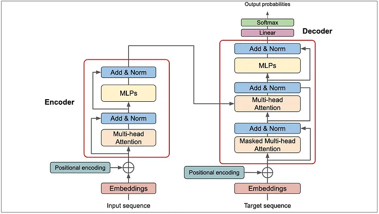

# 🌱 SeedGPT-22M — Compact, Efficient Small Language Model for Practical LLM Development

[Launch SeedGPT Web Chat](https://seedgpt-22m-wo8tdm8nmzrpt4ehwzpybh.streamlit.app/)



---

## 📖 Introduction

**SeedGPT** is a family of lightweight language models (~22 million parameters) designed from scratch to serve as a practical toolkit for building and deploying transformer-based Language Models (LLMs) on resource-limited hardware. Developed in PyTorch and integrated with the Hugging Face ecosystem, SeedGPT offers a balance of simplicity, efficiency, and functionality, making it ideal for researchers, educators, and developers interested in understanding and experimenting with LLMs without requiring massive compute resources.

SeedGPT supports multiple fine-tuned variants optimized for general text generation and chat-style conversations, along with a ready-to-use Streamlit-based chat UI for real-time interaction.

---

## 🚀 Live Demo

Try the model live on the web:  
[Launch SeedGPT Web Chat](https://seedgpt-22m-wo8tdm8nmzrpt4ehwzpybh.streamlit.app/)

---

## 📚 Table of Contents

- [Overview](#-overview)
- [Transformer Architecture](#transformer-architecture)
- [Tokenizer Design](#-tokenizer-design)
- [Model Variants](#-model-variants)
- [Features](#-features)
- [Installation Guide](#-installation-guide)
- [Usage & Web UI](#-usage--web-ui)
- [Project Structure](#-project-structure)
- [Configuration Details](#configuration-details)
- [Dependencies](#-dependencies)
- [Distributed Training](#-distributed-training)
- [Troubleshooting](#troubleshooting)
- [Contributors](#-contributors)
- [License](#-license)
- [References](#-references)
  
---

## 🧠 Overview

SeedGPT demonstrates the full pipeline of building a transformer-based language model from scratch, including:

- Custom transformer architecture implementation
- Tokenizer creation and integration
- Fine-tuning on curated datasets
- Training with multiple GPUs & nodes
- Minimal resource footprint (~22M parameters)
- Streamlit-powered chat interface with session memory

It is inspired by modern LLM principles and open-source models, providing a hands-on, modular foundation for learning and experimentation.

---

## Transformer Architecture

SeedGPT implements a **decoder-only Transformer** architecture with the following core components:

| Component               | Description                                                                                  |
|------------------------|----------------------------------------------------------------------------------------------|
| **Transformer Decoder Blocks** | Stacked layers of self-attention and feed-forward networks with residual connections.       |
| **Positional Embeddings**       | Learnable embeddings added to token embeddings to encode token position information.       |
| **MultiHead-Attention**       | Masks future tokens to ensure autoregressive generation (only past tokens attended).       |
| **Layer Normalization**          | Stabilizes training by normalizing activations within each layer.                          |
| **Residual Connections**         | Skip connections to improve gradient flow and model stability.                            |
| **Output Linear Projection**     | Maps final hidden states to vocabulary logits for token prediction.                       |

The architecture is registered with Hugging Face's `transformers` library for seamless integration:

```
from transformers.models.auto.configuration_auto import CONFIG_MAPPING
from transformers.models.auto.modeling_auto import MODEL_FOR_CAUSAL_LM_MAPPING

CONFIG_MAPPING.register("hf_transformer", HFTransformerConfig)
MODEL_FOR_CAUSAL_LM_MAPPING.register(HFTransformerConfig, HFTransformerModel)

```

This enables loading SeedGPT models via Hugging Face’s `AutoModelForCausalLM` interface.

---

## 🔤 Tokenizer Design

SeedGPT uses a **custom tokenizer** built with the Hugging Face `tokenizers` library, trained on openwebtext dataset. Key aspects include:

- **Byte-Pair Encoding (BPE)** style tokenization for efficient vocabulary compression.
- Vocabulary size (2000) optimized for the 22M parameter model to balance expressiveness and memory.
- Tokenizer scripts located in the `tokenizer/` directory, including tokenizer building and testing.
- Integration via Hugging Face’s `AutoTokenizer` for easy loading and usage.

---

## 🧬 Model Variants

| Model         | Parameters | Training Dataset           | Purpose             | Hugging Face Repo Link                                         |
|---------------|------------|----------------------------|---------------------|---------------------------------------------------------------|
| **SeedGPT-V1** | 22M        | Refined BookCorpus          | General text generation | [SeedGPT-V1](https://huggingface.co/singhsumony2j/SeedGPT-V1) |
| **SeedGPT-V2** | 22M        | TinyStories + Stories Dataset | Story generation     | [SeedGPT-V2](https://huggingface.co/singhsumony2j/SeedGPT-V2) |
| **SeedGPT-V3** | 22M        | LMSYS Chat English          | Chat-style conversations | [SeedGPT-V3](https://huggingface.co/singhsumony2j/SeedGPT-V3) |

---

## ✨ Features

- **Streamlit-powered chat UI** with message history.
- Adjustable **temperature** and **max token length** sliders for generation control.
- Multiple fine-tuned model options selectable at runtime.
- Full **Hugging Face integration** for model and tokenizer loading.
- Supports **GPU acceleration** via CUDA for real-time inference.
- Template-based prompt formatting for consistent chat role separation.

---

## 📦 Installation Guide

### Prerequisites

- Python 3.12 or higher

### Steps

```
git clone https://github.com/sumony2j/SeedGPT-22M.git
cd SeedGPT-22M
pip install -r requirments.txt
```


---

## 🚀 Usage & Web UI

### Launch Streamlit Chat Interface

```
streamlit run web.py
```

The web UI allows you to:

- Select among SeedGPT variants
- Adjust temperature (0.2 to 1.0)
- Set max token length (10 to 4096)
- View interactive chat history with model responses
- Clear chat session

---

## 🧱 Project Structure

```
SeedGPT-22M/
├── Architecture.webp # Model architecture diagram
├── LICENSE
├── README.md
├── requirements.txt # Python dependencies
├── run.sh # Distributed training launcher script
├── web.py # Streamlit chat UI
├── data/ # Dataset download, loading, preprocessing
│ ├── download_dataset.sh
│ ├── loader.py
│ ├── preprocess.py
├── data_preparation/ # Dataset cleaning and extraction scripts
│ ├── bookcorpus_data_extraction.py
│ ├── openwebtext.py
│ └── stories_data_extraction.py
├── fine_tuning/ # Fine-tuning scripts
│ ├── finetune.py
│ ├── lmsys_chat_data_extract.py
│ └── test_finetune.py
├── src/ # Transformer architecture and utilities
│ ├── attention.py
│ ├── block.py
│ ├── config.py
│ ├── convert_to_hf_model.py
│ ├── convert_to_hf_tokenizer.py
│ ├── feedforward.py
│ ├── generate.py
│ ├── main.py
│ ├── positional_embedding.py
│ ├── push_to_hf.py
│ ├── transformer.py
│ ├── utils.py
├── tokenizer/ # Custom tokenizer code
│ ├── tokenizer.py
│ └── test_tokenizer.py

```
---

## 🗂️ Project Structure with Descriptions

### Root Files
- **`web.py`**: Streamlit UI for interacting with the trained model using a custom transformer.
- **`README.md`**: Brief project description.
- **`requirments.txt`**: Python dependencies (`transformers`, `tokenizers`, `streamlit`, etc.)

### 📂 `data/` — Dataset Handling & Tokenization
- **`download_dataset.sh`**: Shell script to download multiple datasets like TinyStories, BookCorpus, LMSYS chats.
- **`loader.py`**: Loads data from a `.zarr` file and batches it for training.
- **`preprocess.py`**: Tokenizes the dataset and stores it into zarr format.
- **`__init__.py`**: Marks package.

### 📂 `data_preparation/` — Raw Dataset Cleaning  
- **`bookcorpus_data_extraction.py`**: Cleans and extracts text from the raw BookCorpus dataset. *(Used to train SeedGPT-V1)*  
- **`openwebtext.py`**: Parses and processes the OpenWebText dataset. *(Used to train the tokenizer)*  
- **`stories_data_extraction.py`**: Cleans and formats data from the TinyStories dataset. *(Used to train SeedGPT-V2)*  

### 📂 `fine_tuning/` — Fine-tuning the Model  
- **`finetune.py`**: Primary script for fine-tuning the transformer model using tokenized Zarr-format data.  
- **`lmsys_chat_data_extract.py`**: Extracts and formats conversational data from the LMSYS Chat dataset. *(Used to fine-tune SeedGPT-V2, resulting in SeedGPT-V3)*  
- **`test_finetune.py`**: Unit testing or dry-run for finetuning setup.

### 📂 `src/` — Model Architecture & Utilities
- **`main.py`**: Entrypoints for model training or generation.
- **`config.py`**: Model configuration class (like hidden size, layers, etc.)
- **`attention.py`**, **`block.py`**, **`feedforward.py`**, **`transformer.py`**: Components of the Transformer architecture.
- **`positional_embedding.py`**: Adds positional encoding to token embeddings.
- **`convert_to_hf_model.py`**: Converts custom transformer to HuggingFace-compatible model.
- **`convert_to_hf_tokenizer.py`**: Same for tokenizer.
- **`push_to_hf.py`**: Push model/tokenizer to HuggingFace Hub.
- **`generate.py`**: Model inference/generation script.
- **`utils.py`**: Utility functions.
- **`__init__.py`**: Package initializer.

### 📁 `tokenizer/`
- **`tokenizer.py`**: Builds a custom tokenizer using HuggingFace `tokenizers` library from jsonl/text data.
- **`test_tokenizer.py`**: Tests the tokenizer on sample inputs.

---


## Configuration Details

Model and tokenizer loading logic in `web.py`:

```
from transformers import AutoTokenizer, AutoModelForCausalLM
import torch

device = "cuda" if torch.cuda.is_available() else "cpu"
model_type = "SeedGPT-V3" # or V1, V2

tokenizer = AutoTokenizer.from_pretrained(f"singhsumony2j/{model_type}")
model = AutoModelForCausalLM.from_pretrained(f"singhsumony2j/{model_type}")
model.to(device)
```


Message formatting uses a Jinja-style template to structure chat roles (user, assistant).

---

## 📄 Dependencies

Key Python packages listed in `requirments.txt`:

```
pandas
torch
datasets
transformers
tokenizers
tiktoken
modelscope
zarr==2.10
numcodecs
tqdm
streamlit
streamlit_chat
```

Install with:

```
pip install -r requirments.txt
```


---

## 🧪 Distributed Training

Use the provided `run.sh` script to launch multi-node distributed training with `torchrun`:

```
bash run.sh
```


Example command inside `run.sh`:

```
torchrun --nproc_per_node=6 --nnodes=3 --node_rank=0 --master_addr="MASTER_IP" --master_port=12345 -m src.main
```


*Note:* Replace `MASTER_IP` with your master node's IP address.

NCCL environment variables are pre-configured for optimized network communication.

---

## Troubleshooting

| Issue                      | Solution                                                      |
|----------------------------|---------------------------------------------------------------|
| CUDA device not available  | Ensure proper CUDA and GPU drivers are installed             |
| Model not loading          | Check internet connectivity for Hugging Face model downloads |
| Streamlit crashes          | Use Python 3.13+, install all dependencies                    |
| Chat not generating output | Increase max tokens or lower temperature                       |

---

## 👥 Contributors

- **Sumony Singh** – [Hugging Face Profile](https://huggingface.co/singhsumony2j)  
Thanks to the open-source communities behind Hugging Face, PyTorch, and Streamlit.

---

## 🪪 License

This project is licensed under the **MIT License**.

---

## 📚 References

- [Building a 2B Parameter LLM from Scratch (Blog)](https://levelup.gitconnected.com/building-a-2-billion-parameter-llm-from-scratch-using-python-1325cb05d6fb)  
- [TinyStories Dataset](https://shorturl.at/F1ZvX)  
- [LMSYS Chat English Dataset](https://shorturl.at/PZANz)  
- [Refined BookCorpus Dataset](https://shorturl.at/FezgK)

---

## 🖼️ Diagram Explanation

The architecture diagram (`Architecture.webp`) illustrates the flow:

1. **Input Tokens** are converted to embeddings.
2. **Positional Embeddings** are added to encode token order.
3. The sum is passed through a stack of **Transformer Decoder Blocks**, each containing:
   - Multi-head **Self-Attention** layers (masking future tokens).
   - **Feedforward Neural Networks**.
   - **LayerNorm** and **Residual Connections** for stability.
4. The final hidden state is projected via a linear layer to produce **logits** over the vocabulary.
5. The model generates tokens autoregressively.

---
